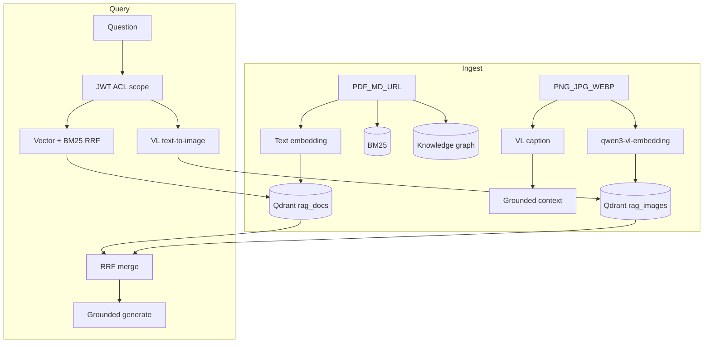

# Production RAG

生产级检索增强问答（RAG）服务：混合检索、有据生成（引用 + 拒答）、Corrective-RAG Agent、JWT 多角色权限与文档分享，以及文本 / 图像双轨检索。


## 特性

- **混合检索**：向量（Qdrant）+ BM25（RRF 融合），可选 GraphRAG 扩展与 Cohere 重排序
- **有据生成**：默认 `grounded` 提示词，回答带 `[n]` 引用；证据不足时拒答
- **Corrective-RAG Agent**（LangGraph）：路由 → 检索 → 相关性评判 → 查询改写 → 生成；与 `/chat` 共用同一检索与生成核心
- **JWT + 文档 ACL**：角色 `admin` / `editor` / `viewer`；管理员可按角色或用户分享文档
- **双轨多模态**：PDF/Markdown 走文本 embedding；图片用 DashScope `qwen3-vl-embedding` 入独立集合并以文搜图；入库生成图像描述供 grounded 回答；与文本结果 RRF 融合
- **工程化能力**：流式输出、语义缓存（可选 Redis）、Guardrails、限流、健康检查、评测与 Docker 部署

## 架构



## 快速开始（Windows 本地）

前置：Python 3.11+、Node.js、本机 Qdrant（`:6333`）。

```powershell
# 1. 配置
copy .env.example .env
# 填写 LLM / Embedding Key；图像轨需 DASHSCOPE_API_KEY + IMAGE_RETRIEVAL_ENABLED=true
# 鉴权示例：AUTH_ENABLED=true，并设置 JWT_SECRET 与 BOOTSTRAP_ADMIN_*

# 2. 安装依赖
pip install -e ".[dev]"
cd frontend; npm install; cd ..

# 3. 启动（另开终端跑 Qdrant 后）
.\scripts\start.ps1
# 前端 http://127.0.0.1:5173  ·  API http://127.0.0.1:8000

# 停止
.\scripts\stop.ps1
```

也可用 Docker：

```bash
cp .env.example .env   # 填入密钥
docker-compose up -d
```

## Demo UI

`frontend/` 为 Vite + React + TypeScript SPA：

- 登录 / 登出（JWT）
- Chat / Agent 流式问答与引用
- 文档上传（PDF / Markdown / 图片）、列表、删除
- 管理员分享文档（按角色或用户）
- 文档范围选择（限制检索语料）

```bash
cd frontend
npm install
npm run dev    # http://localhost:5173
```

将后端 `CORS_ORIGINS` 设为前端源（默认含 `http://localhost:5173`）。

## 鉴权与 ACL

| 角色 | 能力 |
|------|------|
| `admin` | 全部语料；上传 / 删除；分享文档 |
| `editor` | 上传；读写自己的文档及被分享的文档 |
| `viewer` | 只读自己的文档及被分享的文档（无上传） |

关键配置（`.env`）：

```env
AUTH_ENABLED=true
JWT_SECRET=your-long-random-secret
BOOTSTRAP_ADMIN_USERNAME=admin
BOOTSTRAP_ADMIN_PASSWORD=change-me
```

- `POST /auth/login` 获取 JWT  
- `PATCH /ingest/documents/{id}/share` 管理员设置 `allowed_roles` / `allowed_user_ids`  
- `AUTH_ENABLED=true` 时 MCP 工具关闭（无用户上下文，防止绕过 ACL）

## 图像检索（双轨）

```env
DASHSCOPE_API_KEY=sk-xxx
IMAGE_RETRIEVAL_ENABLED=true
VL_EMBEDDING_MODEL=qwen3-vl-embedding
VL_EMBEDDING_DIMENSION=1024
VL_COLLECTION_NAME=rag_images
VL_CAPTION_MODEL=qwen-vl-plus
```

| 轨 | 入库 | 检索 |
|----|------|------|
| 文本 | text embedding → `rag_docs` + BM25 / Graph | 混合检索 |
| 图像 | 原图 VL embedding → `rag_images`；caption 作回答上下文 | 以文搜图，再与文本结果 RRF 融合 |

支持格式：`.png` / `.jpg` / `.jpeg` / `.webp`。

## API 摘要

| Method | Path | 说明 |
|--------|------|------|
| POST | `/auth/login` | 登录，返回 JWT |
| GET | `/auth/me` | 当前用户 |
| GET | `/auth/users` | 用户列表（admin，用于分享） |
| POST | `/chat` · `/chat/stream` | 问答（可选 `sources` / `history`） |
| POST | `/agent` · `/agent/stream` | Corrective-RAG Agent |
| POST | `/ingest` · `/ingest/upload` | 入库（文件 / URL / 上传） |
| GET | `/ingest/documents` | 文档列表（按 ACL 过滤） |
| PATCH | `/ingest/documents/{id}/share` | 分享 ACL（admin） |
| DELETE | `/ingest/documents/{id}` | 删除记录 |
| GET | `/health/live` · `/health/ready` | 健康检查 |

## 主要配置

完整列表见 [`.env.example`](.env.example)。

| 变量 | 默认 | 说明 |
|------|------|------|
| `PROMPT_MODE` | grounded | grounded（引用+拒答）/ basic |
| `RETRIEVAL_MODE` | hybrid | hybrid / dense |
| `RERANKER_PROVIDER` | cohere | cohere / none |
| `CACHE_ENABLED` | false | 语义缓存 |
| `REDIS_URL` | 空 | 空则进程内缓存 |
| `AUTH_ENABLED` | false | JWT + ACL |
| `IMAGE_RETRIEVAL_ENABLED` | false | 图像双轨 |
| `GUARDRAILS_ENABLED` | true | 注入拦截 / PII / 毒性 |

## 开发与评测

```bash
pip install -e ".[dev]"
ruff check .
pytest -q

# 评测说明与结果
# evaluation/README.md  ·  docs/CASE_STUDY.md
```

## 技术栈

Python 3.11+、FastAPI、LangChain / LangGraph、React (Vite)、Qdrant、rank_bm25、DashScope（多模态）、SQLite（用户与 ACL）、可选 Redis / OpenSearch / Cohere Rerank、Docker Compose。

## 设计说明

- **有据生成优先**：宁可拒答，也不编造；评测见 `docs/CASE_STUDY.md`
- **图像回答依赖入库 caption**：检索匹配图像向量，生成阅读描述文本（非每次提问重跑视觉模型）
- **双轨向量空间分离**：文本与图像 embedding 模型不同；跨轨用排名 RRF 融合，不直接比原始分数
- **GraphRAG 偏轻量**：实体匹配为词法级，小规模语料上收益有限
- **多轮问答**：用 fast 模型将追问压缩为独立问题后再检索，生成侧不直接吃完整历史

## License

MIT
